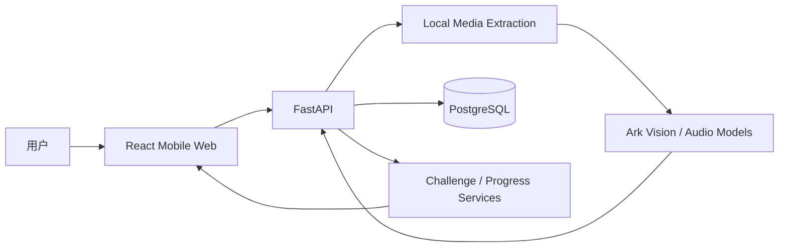

# MicroHabit

> **把健康内容转化为可执行的 7 天微习惯挑战。**

**AI video understanding · React 19 · FastAPI · PostgreSQL · Mobile-first product design**

MicroHabit 是一个移动优先的 AI wellness 产品原型。它尝试解决的不是“再给用户更多健康知识”，而是把用户看到的一段健康视频，转化成一套 **足够小、能开始、能连续执行** 的行动计划。

产品把 **内容理解 → 习惯拆解 → 7 天挑战 → 每日打卡 → 进度反馈 → 成就与复盘** 串成一条完整体验。

---

## 产品思路

很多健康内容的问题不是信息不足，而是信息和行动之间存在断层：

```text
看懂一个健康建议
      ↓
知道“应该做什么”
      ↓
不知道“今天具体做什么”
      ↓
行动成本过高 / 很快放弃
```

MicroHabit 的目标是把这条链路改成：

```text
上传 / 选择健康视频
      ↓
AI 提取可执行建议
      ↓
生成 7 天微行动挑战
      ↓
每日打卡与轻量反馈
      ↓
健康图谱 / 徽章 / 成长反馈
      ↓
阶段复盘
```

## 核心体验

- **AI 视频分析**：对上传视频做本地媒体处理，并在配置模型后调用 Ark 音频 / 视觉能力提取内容；
- **7 天挑战生成**：将健康建议转译为每天可执行的小任务；
- **健康图谱**：用节点与进度变化展示行为积累，而不是只显示一串数据；
- **打卡与复盘**：提供每日完成反馈和阶段报告；
- **成长机制**：通过徽章、积分与 companion growth 增强持续使用动力；
- **移动优先设计**：主要围绕 390px 手机视口设计，同时支持桌面浏览器运行。

## 产品状态

当前版本是一个 **可运行的 full-stack prototype**：

- 前端默认连接真实 FastAPI；
- PostgreSQL 负责后端持久化；
- 保留 deterministic seed data，便于稳定演示；
- 配置 Ark API 后，上传视频会执行真实的本地媒体提取与音频 / 视觉分析；
- 浏览器仅持久化 device id 和轻量 UI 状态。

## 技术架构



## 技术栈

| 层 | 技术 |
|---|---|
| Frontend | React 19, TypeScript, Vite |
| Routing / Data | React Router, TanStack Query |
| State | Zustand |
| Motion | Framer Motion |
| Backend | FastAPI |
| ORM | SQLAlchemy 2 |
| Database | PostgreSQL |
| AI | Ark Vision / Audio |

## 项目结构

```text
src/
  app/        App shell、router、query client、flow store
  mocks/      Demo API handlers 与 scenario data
  pages/      Mobile product pages
  shared/     Shared components、types、global styles

backend/
  app/        FastAPI routes、models、services
  alembic/    Database migration
  tests/      API flow tests
```

## 本地运行

安装前端依赖：

```bash
npm install
```

创建后端环境：

```bash
python3 -m venv .venv
.venv/bin/python -m pip install -r backend/requirements.txt
```

启动 PostgreSQL：

```bash
docker compose up -d postgres
```

启动 API：

```bash
npm run dev:backend
```

启动前端：

```bash
npm run dev:frontend
```

前端默认访问真实 API：

```text
http://127.0.0.1:8000
```

如需使用浏览器内 mock：

```bash
VITE_USE_MOCK_API=true
```

## 启用真实视频 AI 分析

```bash
ARK_API_KEY=...
ARK_BASE_URL=https://ark.cn-beijing.volces.com/api/v3
ARK_VISION_MODEL=doubao-seed-2-0-lite-260215
ARK_AUDIO_MODEL=doubao-seed-2-0-lite-260428
MICROHABIT_STORAGE_DIR=./storage
```

## 构建

```bash
npm run build
npm run preview
```

## 这个项目主要证明什么

MicroHabit 更偏向我对 **AI-native consumer product** 的探索：AI 不应该只停留在“分析一段内容”，而应该继续影响用户下一步看到什么、做什么、如何获得反馈。

这个项目重点练习了：

- 从 AI 能力反推产品交互，而不是给已有页面硬加聊天框；
- 把一次性模型输出转化成持续 7 天的状态型产品体验；
- 同时实现产品设计、前端交互、后端 API、数据库和 AI 媒体链路；
- 用 deterministic demo 与 real API 两种路径兼顾稳定演示和真实能力验证。